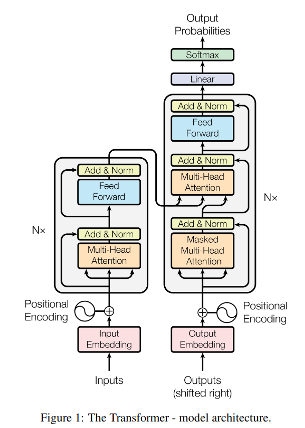
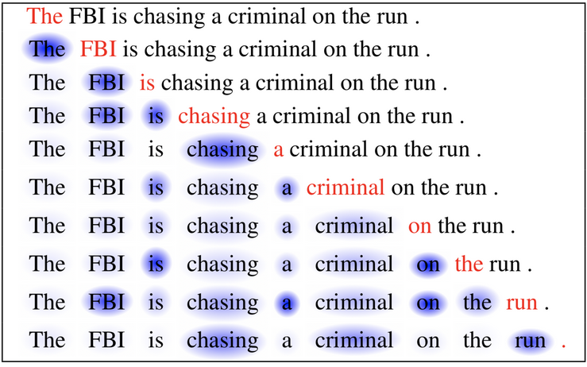
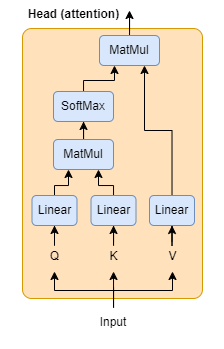
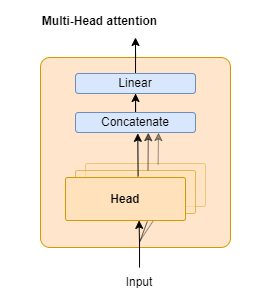
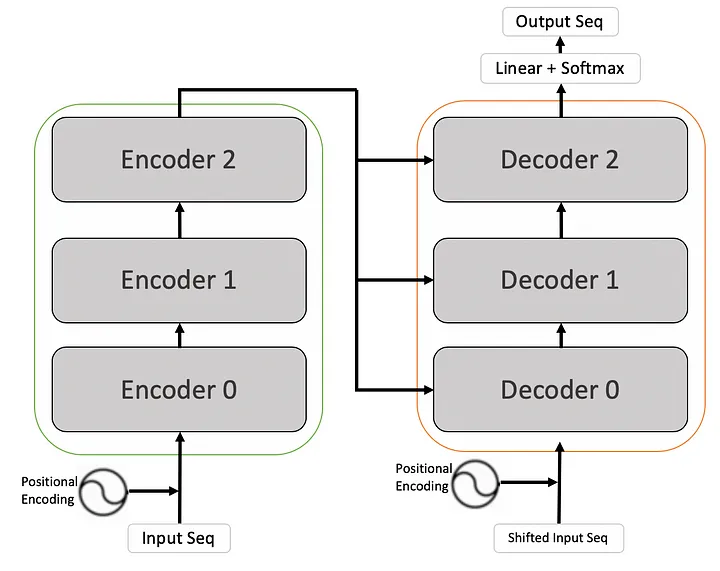
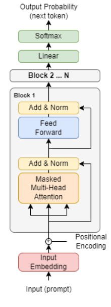
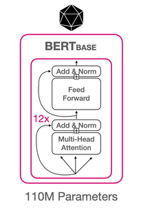
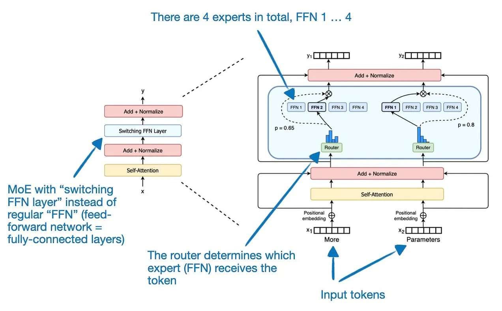
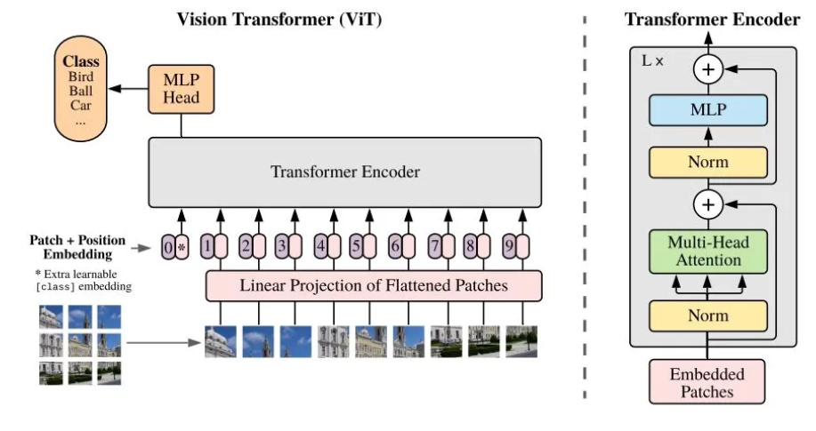

# Transformers

## 2017 - Attention is all you need
> *The dominant sequence transduction models are based on complex recurrent or convolutional neural networks in an encoder-decoder configuration. The best performing models also connect the encoder and decoder through an attention mechanism. We propose a new simple network architecture, the Transformer, based solely on attention mechanisms, dispensing with recurrence and convolutions entirely. Experiments on two machine translation tasks show these models to be superior in quality while being more parallelizable and requiring significantly less time to train.{...} Our model establishes a new single-model state-of-the-art BLEU score of 41.8 after training for 3.5 days on eight GPUs, a small fraction of the training costs of the best models from the literature. We show that the Transformer generalizes well to other tasks by applying it successfully to English constituency parsing both with large and limited training data.*

The goal of the Transformer architecture was to improve Seq2Seq models (also known as Encoder-Decoder models) through self-attention and positional encoding.  
The proposed Vanilla Transformer architecture was the following :  

 

There is a lot to unpack here, so we will first focus on each components individually. 
  
### Tokenizer - Embedding layer 

We start by tokenizing the input sequence, which can be as simple as a one-hot encoder but it often is a Byte-Pair encoder (there is also Wordpiece and Unigram tokenizers). This block is often called the tokenizer. 
Then we pass through an embedding layer which gives us a vector representation for each token in our input sequence.

### Positional encoding

Positional encoding is crucial to retain the sequential nature of the input data. Why?  If we look at the architecture of the tranformer we can see that it doesn't have LSTM or GRU blocks as previous Encoder-Decoder architectures had, since we don't have those to retain a sense of the sequence we need a new way to encode it, hence positional encoding was implemented.  
  
*<u>Side-Note</u>: In previous LSTM-based architecture tokens were consumed sequentially (one after the other), but in transformers they are consumed all at once and this is part of what makes transformers much more efficient.*
  
So how does it work?  
Basically for each token we take the embedding vector and add a position vector of the same size. Each position vector is unique to one position in the input sequence, they are formed using diferent sinusoidal wavelength. 
  
If you want to dig deeper into why those postional vectors are formed using sinusoidal wavelength, check the following ressources: 
- https://kazemnejad.com/blog/transformer_architecture_positional_encoding/
- https://www.youtube.com/watch?v=dichIcUZfOw  
- https://datascience.stackexchange.com/questions/51065/what-is-the-positional-encoding-in-the-transformer-model
- https://machinelearningmastery.com/a-gentle-introduction-to-positional-encoding-in-transformer-models-part-1/

### Multi-head Attention block
We now reach the mmost important component of the transformer architecture, the multi-head attention block.  
But first let's look at the image below to get a good sense of what attention does:  

  
  
What self-attention does is the following: for a word in a sequence it gives a weight to the other words relative to the importance of the relationship between those words. 

#### Self-Attention
One self-attention mechanism is often refered to as a head and is composed as follows:  

 

Here  we have:
- Q : Query
- K : Key 
- V : Value  

For educational purpose let's imagine you are a word and want to know the relative importance between you and the other words around. So what do you do? You just ask, and you emit a query to all the other words who will answer back by giving you their key.  
By doing a dot product between your query and their keys you can compute an importance score for each of them. That gives you the attention filter (a matrix of size input_length*input_length) that you pass through a softmax function to put the values between 0 and 1.  
The last step consist in applying that attention filter to the value tensor (by doing a dot product) to only keep the interesting linguistic charateristics. 

#### Multi-Head Attention
Intuition for multi-head: a sentence might contain several linguistics characteristics so we want multiples attention head that can each attend to one of those characteristics. 
   
  

So what happens here? Well it's pretty simple we concatenate the output tensors of the attention head and feed it through a linear layer to shrink its size back to the input shape

Some ressources if you want to dig deeper: 
- https://www.youtube.com/watch?v=mMa2PmYJlCo&t=4s
- https://d2l.ai/chapter_attention-mechanisms-and-transformers/multihead-attention.html
- https://slds-lmu.github.io/seminar_nlp_ss20/attention-and-self-attention-for-nlp.html

### Add & Norm

Here you add the input to the output of a feed-forward or multu-head attention module, and then normalize it across the layer. This is called a skip connection and helps with the vanishing and exploding gradient problems.  

Here is a link if you want to know more on LayerNorm: 
- https://www.pinecone.io/learn/batch-layer-normalization/#What-is-Layer-Normalization

Here is a link if you want to know more on skip-connections: 
- https://www.analyticsvidhya.com/blog/2021/08/all-you-need-to-know-about-skip-connections/

### Feed Forward block

This is simply two dense layers with a ReLu activation in between. Activations functions have changed in more modern transformers architecture see [here](https://medium.com/@tariqanwarph/activation-function-and-glu-variants-for-transformer-models-a4fcbe85323f).  
This block can be viewed as a kind of "memory bank" where the model stores knowledge. Intuition behind this representation can be found here: https://arxiv.org/abs/1907.01470  

### Back to the transformer
 

#### Scaling
One transformer block is cool but not very useful. So how do we scale?  
Well we simply stack transformer blocks one on top of the other. 

   

Some of the most famous model of this class are models from the T5 and BART families.  
Sequence-to-sequence models are best suited for tasks revolving around generating new sentences depending on a given input, such as summarization, translation, or generative question answering.  

## Auto-Regressive Transformers (Decoder models)
Those models are best suited for tasks involving text generation, famous models from this class are GPT, LLAMA, Mistral.

 How do they work?  

 Well it's simple just keep the the decoder part of the transformers architecture and voilà! But keep in mind that in that case attention is only for past tokens, meaning that for a token attention is computed only for the tokens that came before in the sequence. 

## Auto-Encoder Transformers (Encoder models)
Now if we keep only the decoder part of the transformer architecture we get the Encoders models.
Those models are often referred to as having bi-directional attention meaning that attention wise each token in a sequence attends to all the other tokens.  

Encoder models are best suited for tasks requiring an understanding of the full sentence, such as sentence classification, named entity recognition (and more generally word classification), and extractive question answering.

The most famous models from this family are the BERT models and all their different flavors (DeBERTa, RoBERTa, CamemBERT...)  

*If you want to dig more in the bert architecture: [bert deep-dive](https://huggingface.co/blog/bert-101)* 

## Mixture of Experts Models
They are a fairly recent family of models where the FFN block is replaced by a Mixture of Experts block, which is basically several FFN in parallel and a router layer that decides which FFN is activated for each token.  

By doing that you get the capacity of bigger models while only using a fraction of the parameters at inference. For example Mixtral 8x7B, is an 8-expert, sparse mixture of experts (SMoE) model with about 52 billion total parameters of which 12B are active at inference.  

  

*You can find a deep-dive in the MoE architecture [here](https://huggingface.co/blog/moe).*

## Vision Transformers
Transformers have also been succesfully adapted to tasks other than NLP, such as TimeSeries and Computer Vision. Here we will quickly see how vision transformers work.  

  

The idea is pretty simple, an image is divided into patches that are flattened and become the tokens for the model (encoder architecture in the ViT paper).  

When trained on large datasets they are on-par with or better than the CNN models. But more importantly they opened the door to multi-modal models where text and images can be processed together. 
